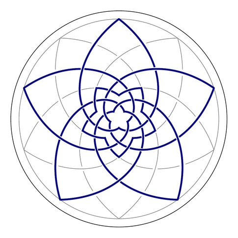

Copyright (c) 2013, Louis G. "Ted" Stern, all rights reserved

See LICENSE for licensing information.

This is a collection of simple scripts to draw a set of logarithmic spirals that touch significant points in a set of nested regular pentagrams, decagrams, pentagons and pentagrams.

The basic spiral equation looks like

r = phi ^ (5 * theta / pi)

where phi equals the golden ratio, 2 * cos(pi/5)

These designs are the result of doodling around, trying to project the interlocking cycles of the edges of an icosadodecahedron onto the plane in a regular way.

Here's an example of the output of **lotus_polar.py**:

